### Mobility App

---

#### Mobile device Experience📱

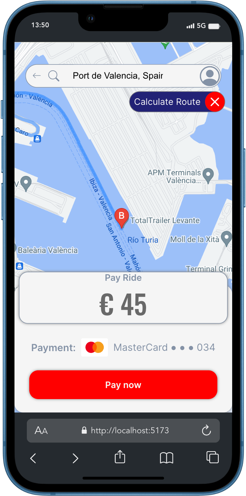

---

#### Desktop Experience 💻

---

[![GITHUB]][github-url][![DOCKER]][docker-url][![Mongo][MongoDB]][MongoDB-url][![Node][Node.JS]][Node.JS-url][![Express][Express.js]][Express.js-url]![REACT]![JAVASCRIPT]<a href="https://developer.mozilla.org/es/docs/Web/CSS">[![JWT]][JWT-url]

[JWT]: https://img.shields.io/badge/JWT-black?style=for-the-badge&logo=JSON%20web%20tokens
[JWT-url]: https://jwt.io/
[Express.js]: https://img.shields.io/badge/express.js-%23404d59.svg?style=for-the-badge&logo=express&logoColor=%2361DAFB
[Express.js-url]: https://expressjs.com/
[MongoDB]: https://img.shields.io/badge/MongoDB-%234ea94b.svg?style=for-the-badge&logo=mongodb&logoColor=white
[MongoDB-url]: https://www.mongodb.com/es
[Node.JS]: https://img.shields.io/badge/node.js-026E00?style=for-the-badge&logo=node.js&logoColor=white
[Node.JS-url]: https://nextjs.org/
[MYSQL]: https://img.shields.io/badge/mysql-3E6E93?style=for-the-badge&logo=mysql&logoColor=white
[MYSQL-url]: https://www.mysql.com/
[GITHUB]: https://img.shields.io/badge/github-24292F?style=for-the-badge&logo=github&logoColor=white
[github-url]: https://www.github.com/
[GIT]: https://img.shields.io/badge/git-F54D27?style=for-the-badge&logo=git&logoColor=white
[git-url]: https://git-scm.com/
[LINKEDIN]: https://img.shields.io/badge/linkedin-0274B3?style=for-the-badge&logo=linkedin&logoColor=white
[LINKEDIN-url]: https://www.linkedin.com/
[JS]: https://img.shields.io/badge/javascipt-EFD81D?style=for-the-badge&logo=javascript&logoColor=black
[js-url]: https://developer.mozilla.org/es/docs/Web/JavaScript
[DOCKER]: https://img.shields.io/badge/docker-2496ED?style=for-the-badge&logo=docker&logoColor=white
[docker-url]: https://www.docker.com/
[sequelize-url]: https://www.sequelize.org/
[gmail-url]: https://www.gmail.com/
[JWT]: https://img.shields.io/badge/JWT-black?style=for-the-badge&logo=JSON%20web%20tokens
[JWT-url]: https://jwt.io/

</a>

[JAVASCRIPT]: https://img.shields.io/badge/JavaScript-F7DF1E?style=for-the-badge&logo=javascript&logoColor=black
[REACT]: https://img.shields.io/badge/React-20232A?style=for-the-badge&logo=react&logoColor=61DAFB
[MYSQL]: https://img.shields.io/badge/mysql-3E6E93?style=for-the-badge&logo=mysql&logoColor=white
[MYSQL-url]: https://www.mysql.com/
[GITHUB]: https://img.shields.io/badge/github-24292F?style=for-the-badge&logo=github&logoColor=white
[github-url]: https://www.github.com/
[GIT]: https://img.shields.io/badge/git-F54D27?style=for-the-badge&logo=git&logoColor=white
[git-url]: https://git-scm.com/
[DOCKER]: https://img.shields.io/badge/docker-2496ED?style=for-the-badge&logo=docker&logoColor=white
[docker-url]: https://www.docker.com/

Thank you very much for your interest in my work. It's the last project, a complete full stack project with Geekshubs Academy of the Full Stack Development Bootcamp 🚀.
This is design of Mobility-API-Backend repository ( the ninth and last project of the course ).

---

### Description

The users hire a service to transport people from one place to another paying a price for it. The Users can register for the application, log in and access it.
The next step is to create the mobility application for car drivers, to complete all the functions of the application. Relationships and migrations already exist in this database.
The registered user can search for a destination, choose between different types of cars and make the trip. A driver responds to the request and picks up the passenger, once the trip is completed, they can rate the driver. Users must complete their profile and choose the method of payment. They can also access their travel history.

---

### Develop

Is a SPA (single-page application) with react router dom to organize the routes.
The frontend is connected to MySQL DB data base created in Mobility API Backend.
We use redux to save token and other variables.

#### First Data Base Structure

---

- Users
- Drivers
- Trips

---

- Cars
- Brands

---

- User
- Drivers
- Roles

---

Thats tables have relation between us.

#### Data Base Diagram

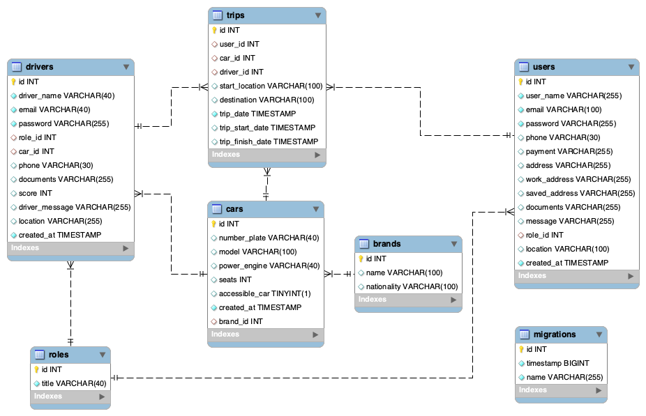

---

#### Develop

##### REST API design for FRONTEND

Create three main tables, User, Driver and Trip. They are related to each other. The fields of the Trip table are: id, user id, car id, driver id, start location, destination, trip date, trip date start and trip date finish.
The User table fields are: user name, email, password, role, phone, payment, address, work address, saved address, documents, message and location.
The Driver table fields are: driver name, email, password, role, phone, score, car id, documents, driver message and location.

---

#### Views

#### Computer Device 💻

##### Register page

`http://localhost:5174/register`

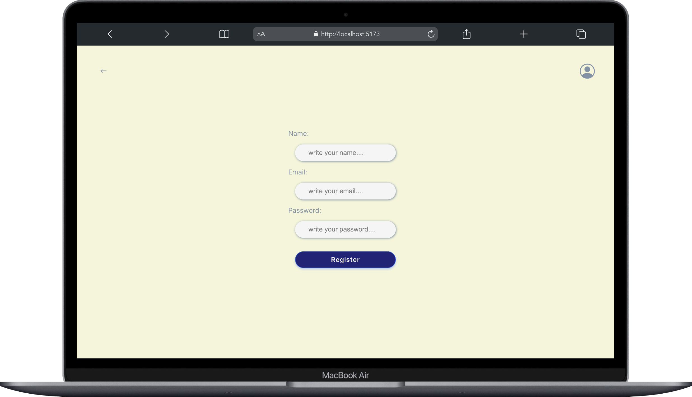

---

#### Login page

`http://localhost:5174/login`

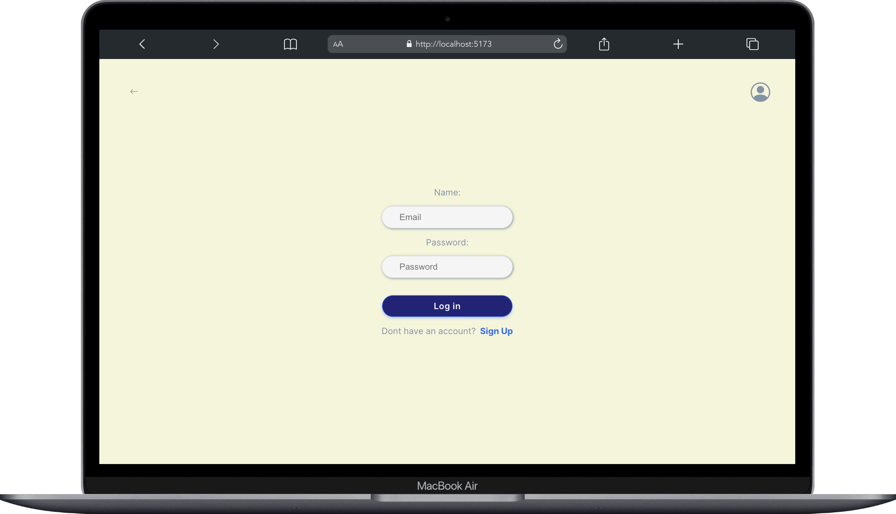

---

#### Home page

`http://localhost:5174`

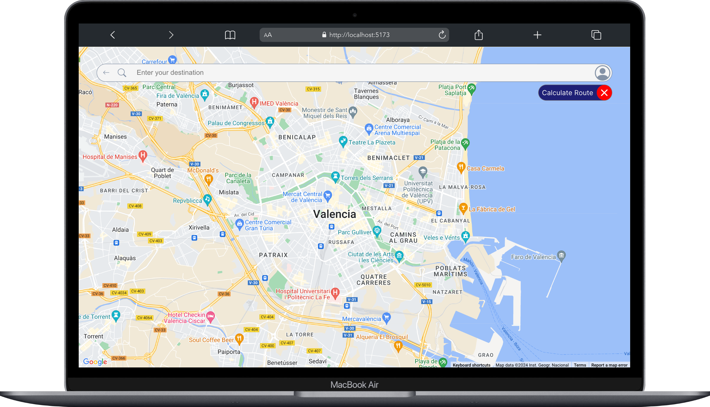

---

#### Editable User profile

`http://localhost:5174/profile`

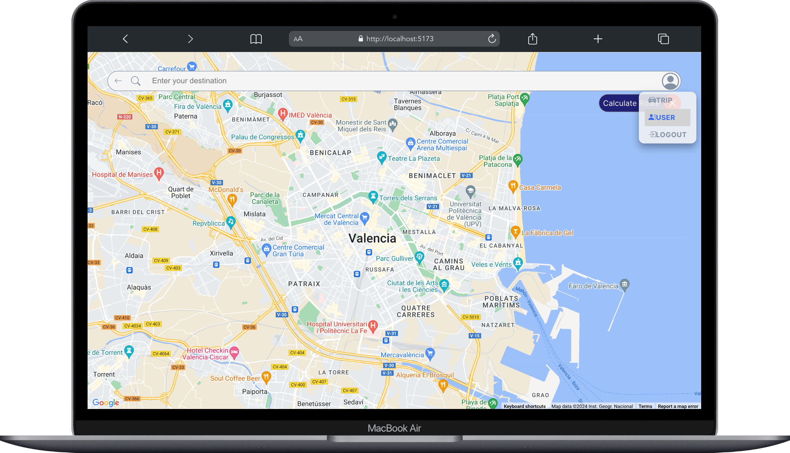

---

#### Start a Trip

`http://localhost:5174`

---

#### Super Admin Dashboard

---

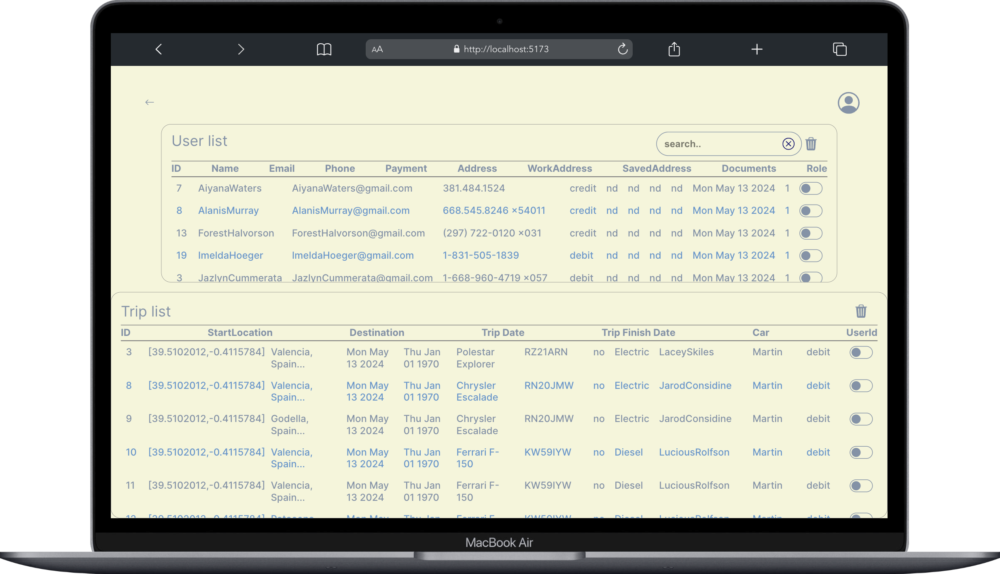

`http://localhost:5174/managment`

---

### Delete one or more Trips & delete one or more Users (SuperAdmin)

`http://localhost:5174/managment`

---

#### Search Users by name or email (superAdmin)

---

`http://localhost:5174/managment`

---

#### Mobil device 📱

##### Register page

`http://localhost:5174/register`

---

#### Login page & check inputs errors

`http://localhost:5174/login`

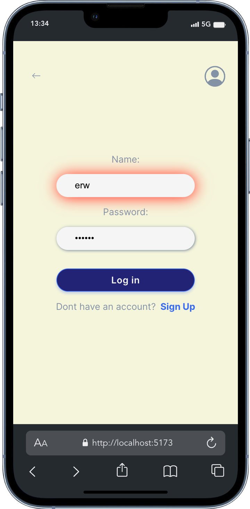

---

#### Payment Design

---

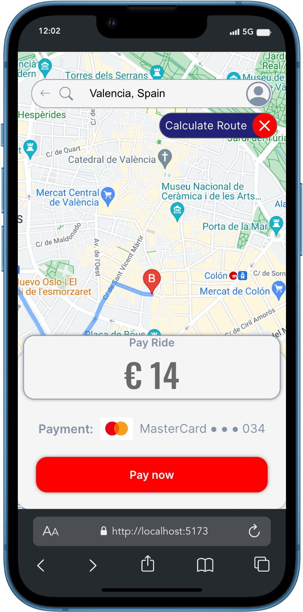

---

### Design

---

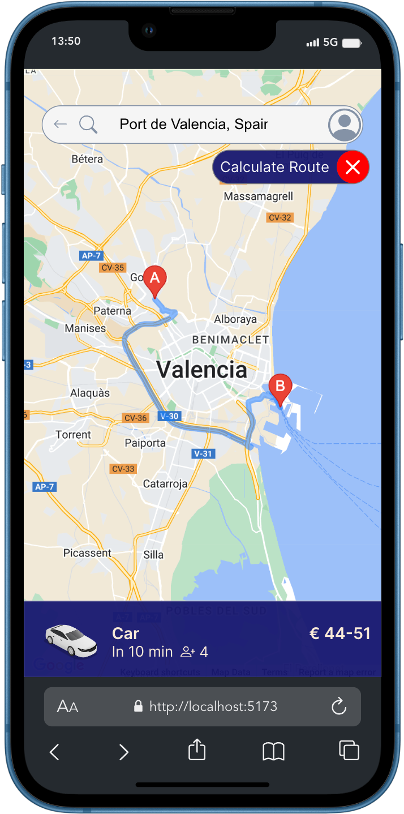

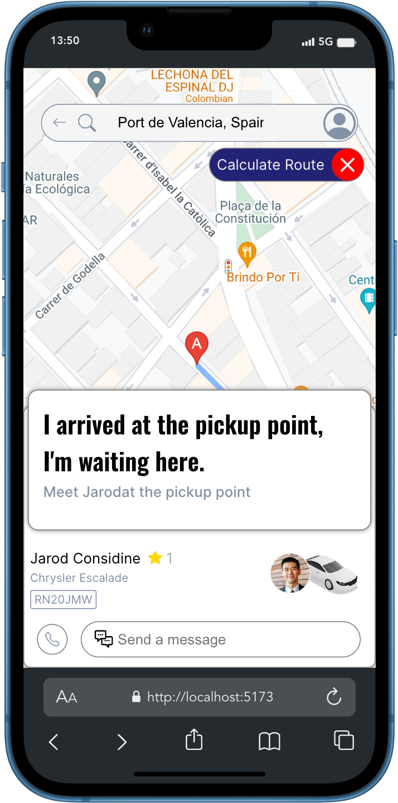

---

The whole project is designed with CSS without external libraries except the error managment external library.
It is responsive on mobile, tablet or desktop and is very easy to configure in Dark 🌘 and Light ☀️ mode.

---

#### App Deployed ⚙️

<ol>

<li> Clone Repo

`npm install`

</li>

<li>

Launch the project in your local device:

`npm run dev`

</li>

</ol>

<ol>

### Enviroment variables 🔑

The app need google maps api key to work. Attach file `.env.example`

`VITE_API_URL = http://localhost:XXXX/`

`VITE_GOOGLE_MAPS_API_KEY=XXXX`

</ol>

<li>Then in localhost:PORT, will be launched the application, and you will be on the landing page (Home).

</li>

---

### Libraries used

I decided to use google maps plataform libraries to get localization and routes.

#### Google APIs Node.js Client

`https://www.npmjs.com/package/googleapis`

---

I choose React-Toasty to show error messages

#### React-Toastify

`https://www.npmjs.com/package/react-toastify`

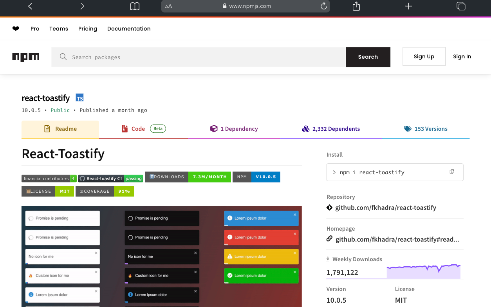

---

### Next steps ⎘

Create Driver mobility app to pick up a trip from a user, edit driver profile, send a message to the passenger and monitor the benefits obtained from work.
Continue to build components, buttons and inputs from the respective endpoints created in the backend and think about future functionality.
Refactoring and testing.
Add users & drivers image to database.

---

## Contact

